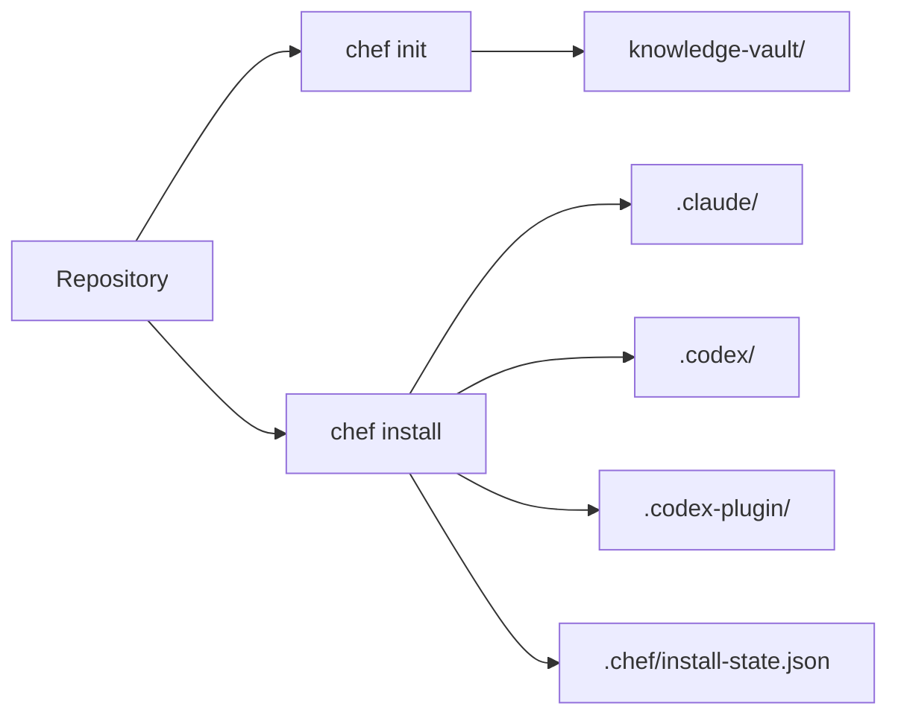

# Chef

[](https://github.com/mahdisanagostar/chef/actions/workflows/ci.yml)


Chef turns a repository into a project-local runtime for Claude and Codex. It installs the right skills into the repo, keeps an Obsidian-compatible knowledge vault nearby, wires MCP servers where they belong, and records install truth so the setup stays inspectable instead of becoming personal machine state.

## About

Chef exists for teams that want agent behavior to live with the project, not inside one developer's laptop setup. A fresh clone can be turned into a shared Claude and Codex workspace with the same routing rules, the same enabled packs, the same MCP layout, and the same graph-first knowledge workflow.



## What Chef Handles

| Label | What it does in practice |
| --- | --- |
| `Hosts` | Installs project-local runtime assets for Claude, Codex, or both. |
| `Knowledge` | Creates and maintains an Obsidian-compatible vault with graph-first retrieval. |
| `Packs` | Turns groups of skills and MCP-capable integrations on or off without hand-editing runtime folders. |
| `MCP` | Registers built-in knowledge, review, and security MCP servers where the active host expects them. |
| `Verification` | Records install fidelity in `.chef/install-state.json` and checks the repo state with `chef verify`. |

## Prerequisites

Before installing Chef, make sure the machine has:

- `Python 3.11+`
- `git`
- `pip`
- `Node.js 18+` and `npx` for browser tooling and some MCP-connected workflows
- `gh` only if you want GitHub publishing and PR flows

If you want local graph refresh, install the optional graph extra. Chef uses `graphify` through the `graphifyy` package.

## Install

### macOS and Linux

```bash
python3 -m venv .venv && source .venv/bin/activate
pip install -e . && pip install -e '.[graph]'
chef init --project . --host both --vault new && chef install --project . --host both --offline && chef verify --project .
```

### Windows PowerShell

```powershell
py -3.11 -m venv .venv; .\.venv\Scripts\Activate.ps1
pip install -e .; pip install -e ".[graph]"
chef init --project . --host both --vault new; chef install --project . --host both --offline; chef verify --project .
```

If you only need one host, replace `--host both` with `--host claude` or `--host codex`.

## First Run

After the initial install, Chef keeps the repo readable:

- `chef init` writes the project manifest and vault layout.
- `chef install` syncs bundled skills, enabled packs, external skill sources, and host-specific MCP config.
- `chef verify` checks policy files, runtime folders, MCP declarations, and install-state records.

For a typical team workflow, the next commands usually look like this:

```bash
chef pack-enable --project . --pack media --offline
chef pack-profile --project . --profile full --offline
chef graph-refresh --project . --execute
```

## What Appears in the Repo

| Path | Purpose |
| --- | --- |
| `.claude/` | Project-local Claude runtime, skills, and commands. |
| `.codex/` | Project-local Codex runtime, shared skills, and routing helpers. |
| `.codex-plugin/` | Codex plugin payload plus generated MCP registration. |
| `.chef/` | Manifest, enabled packs, vendor cache, and install-state truth. |
| `knowledge-vault/` | Obsidian-compatible vault used for notes, graph output, and retrieval. |

## Why This Structure Works

Chef keeps two important promises.

First, the runtime stays inside the repository. That makes onboarding faster and drift easier to spot, because the active agent setup travels with the project.

Second, the setup stays modular. The `core` pack keeps the default install lean, while optional packs add media, UX, review, security, or orchestration layers only when the repository actually needs them.

## Common Commands

```bash
chef install --project . --host both --offline
chef pack-status --project .
chef verify --project .
chef graph-refresh --project . --execute
```

Use `./bin/chef --help` if you want the local wrapper without relying on an editable install.

## Documentation

When you need one level deeper, start here:

- [Install Guide](docs/install.md)
- [Architecture](docs/architecture.md)
- [Catalog Schema](docs/catalog-schema.md)
- [Manifest Schema](docs/manifest-schema.md)
- [Skill Audit](docs/skill-audit.md)
- [Tool Matrix](docs/tool-matrix.md)

## References

- [Anthropic: Claude Code overview](https://docs.anthropic.com/en/docs/claude-code/overview)  
  Useful for understanding the Claude-side host model that Chef installs into the repository.

- [OpenAI: Codex cloud](https://platform.openai.com/docs/codex)  
  Useful for understanding the Codex-side coding-agent workflow that Chef supports and extends locally.

- [Model Context Protocol: What is MCP?](https://modelcontextprotocol.io/introduction)  
  Useful for understanding the protocol behind Chef's MCP server wiring and host integration model.

- [Obsidian Help: How Obsidian stores data](https://help.obsidian.md/data-storage)  
  Useful for understanding why Chef keeps its knowledge base in a plain-text vault structure inside the repo.
